# Conceptual Map of the Multi-Sheeted N-gon Tiling Project

This document visualizes the relationships between concepts defined in `glossary.md`
using a variety of Mermaid diagrams. Each diagram highlights a different facet of
the project's intellectual architecture.

---

## 1. Top-Level Thematic Architecture

A high-level flowchart showing how the major glossary sections feed into one another.
The reconnection framework sits at the center, drawing from algebra, geometry, and
group theory, and feeding into physics, computation, and dimensional analysis.

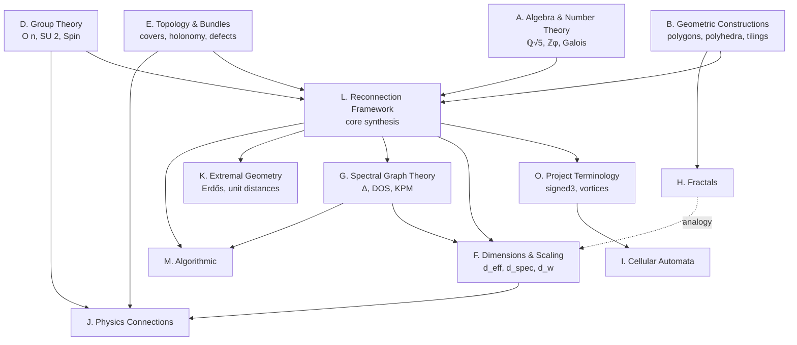

---

## 2. The Algebraic Backbone: ℚ(√5) and Its Children

A class-style diagram showing the algebraic hierarchy that underwrites pentagonal
tilings. Each box names a concept and its key invariants.

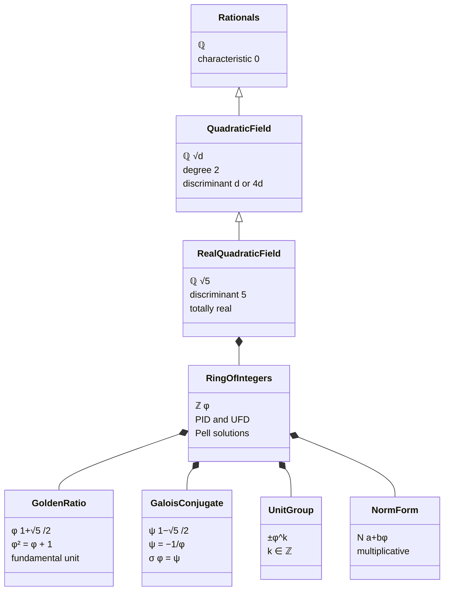

---

## 3. The Four-Level Reconnection Hierarchy

The central classification of the project, displayed as a decision tree. Each branch
corresponds to a glossary "Criterion" from section L.

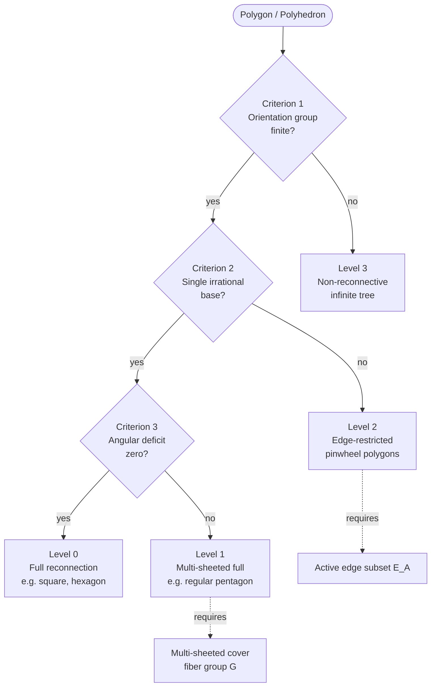

---

## 4. From Pentagon to Multi-Sheeted Cover

A flowchart tracing how the 36° angular deficit of the regular pentagon forces the
multi-sheeted construction, ultimately giving rise to spinor-like holonomy.

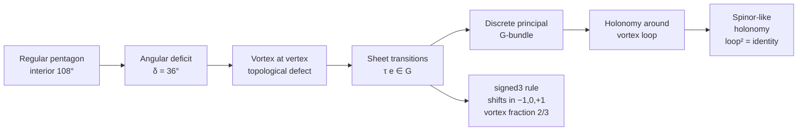

---

## 5. Group-Theoretic Web

A graph of the finite and continuous groups appearing in the project, showing the
chain of covers and inclusions.

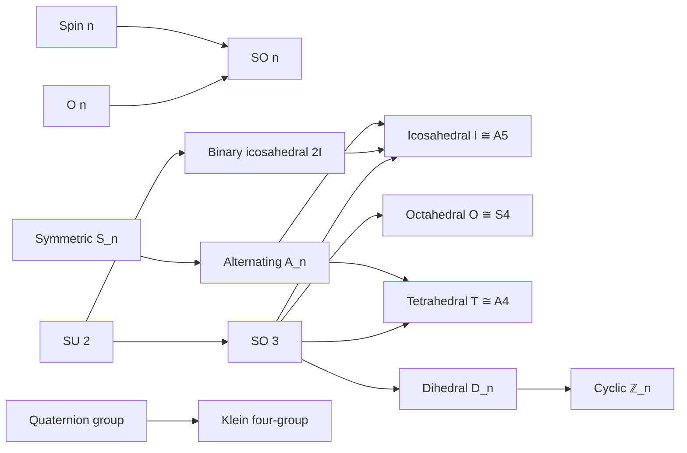

---

## 6. Topology Stack Behind Sheet Transitions

A class diagram of the topology section: how covering spaces, bundles, and
connections combine to formalize "sheets".

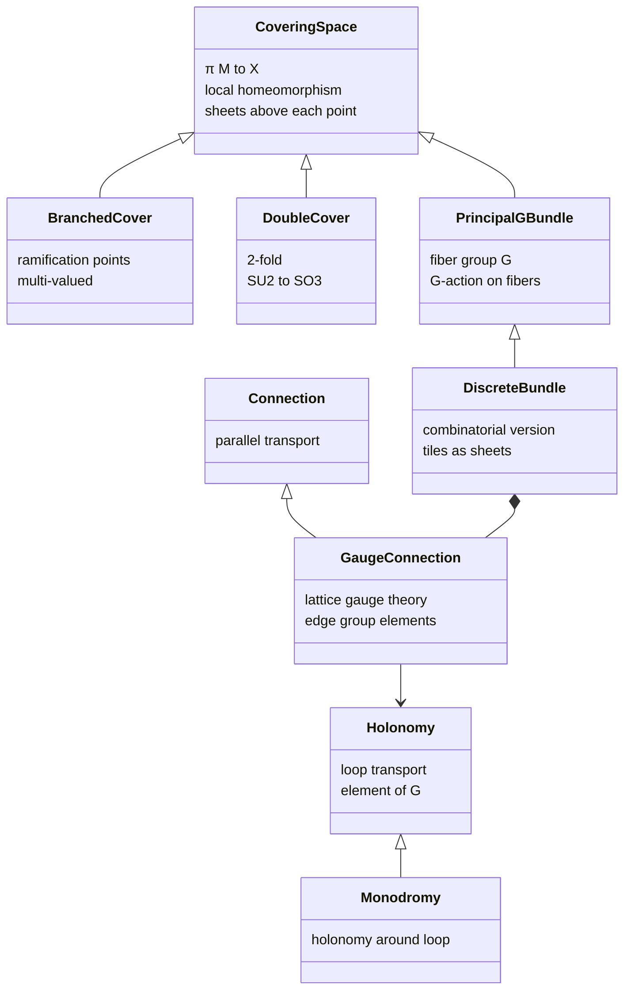

---

## 7. Dimensions: Three Numbers, One Relation

A focused diagram on the Alexander–Orbach relation tying the three dimensional
exponents together.

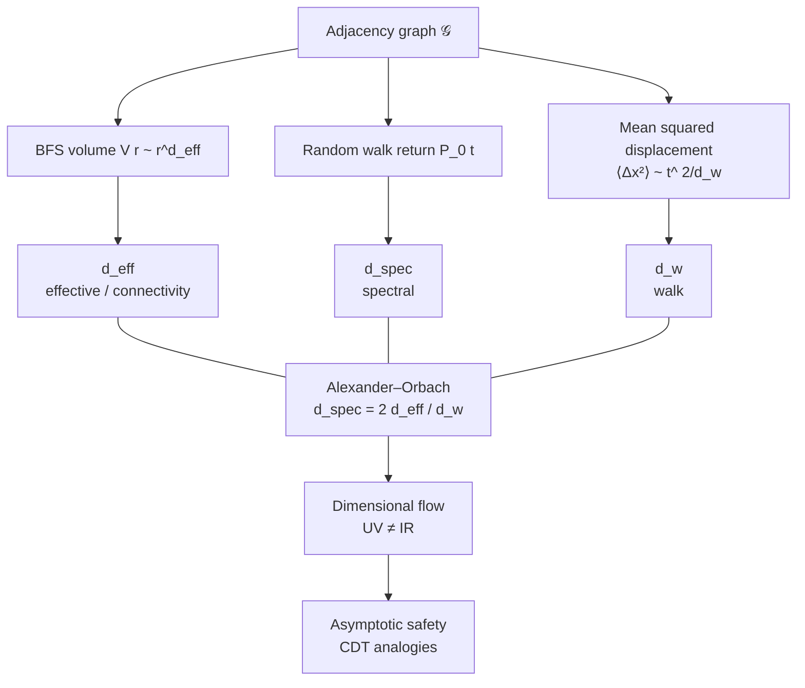

---

## 8. Spectral Pipeline (Computational)

Sequence diagram showing how an adjacency graph becomes a density of states and
thence a dimensional exponent.

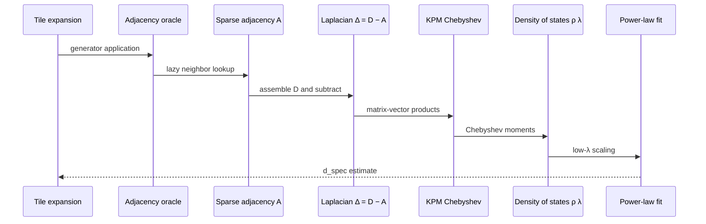

---

## 9. State Machine: Random Walk on the Tiling

A state diagram capturing the diffusion regimes referenced by walk dimension.

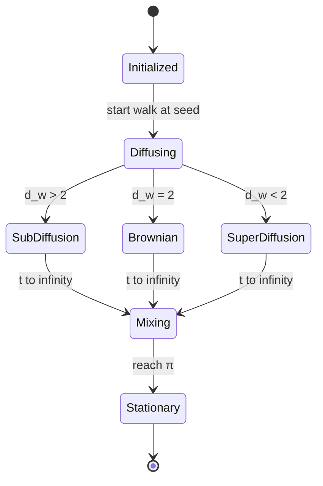

---

## 10. Erdős & Extremal Distance Geometry

How the pentagonal lattice plugs into classical combinatorial-geometry problems.

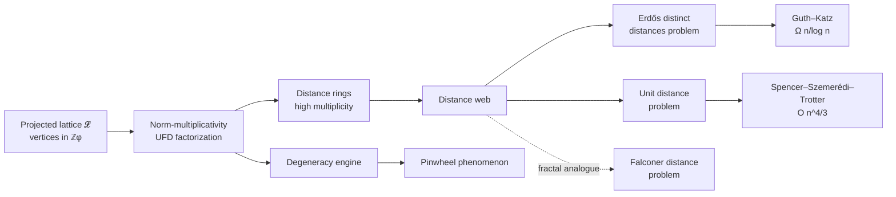

---

## 11. Physics Mind-Map

A mind-map view of the physics connections.

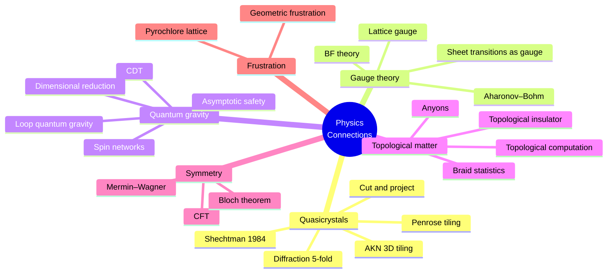

---

## 12. Fractal Dimensions Reference

A small comparison graph for fractals mentioned in section H.

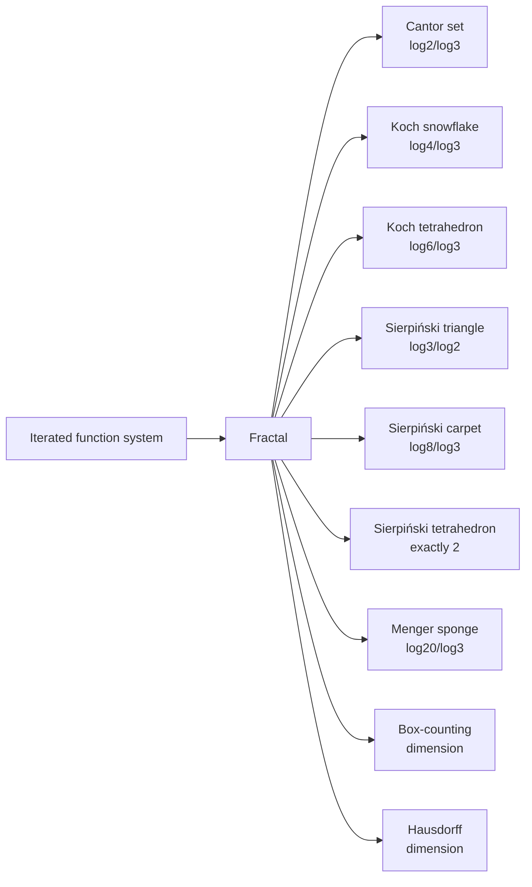

---

## 13. Cellular Automata on Sheeted Tilings

How CA concepts connect to the project's topological structure.

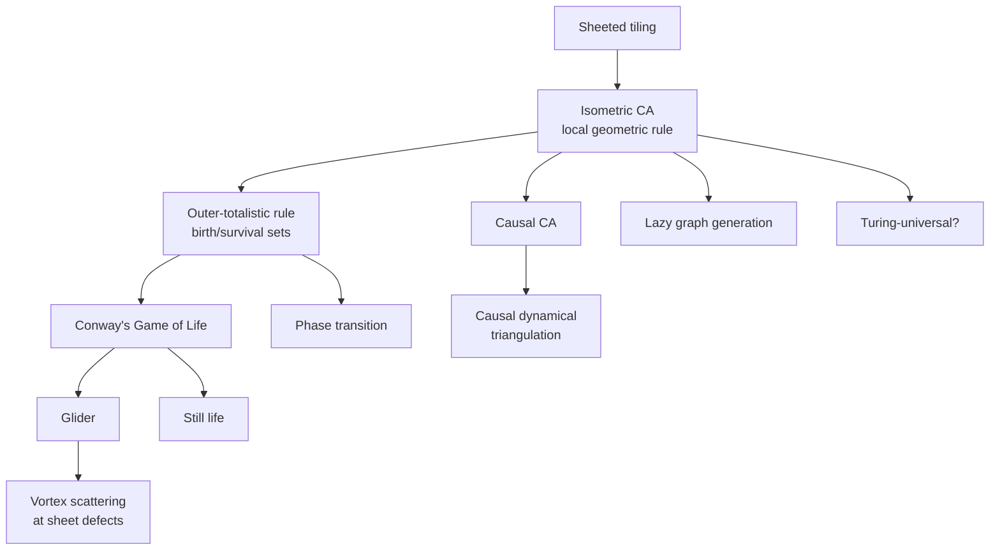

---

## 14. Spinor-Like Holonomy Cycle (Sequence View)

A sequence diagram showing why one loop around a vortex returns the "wrong" sheet
and two loops restore identity — a discrete spinor.

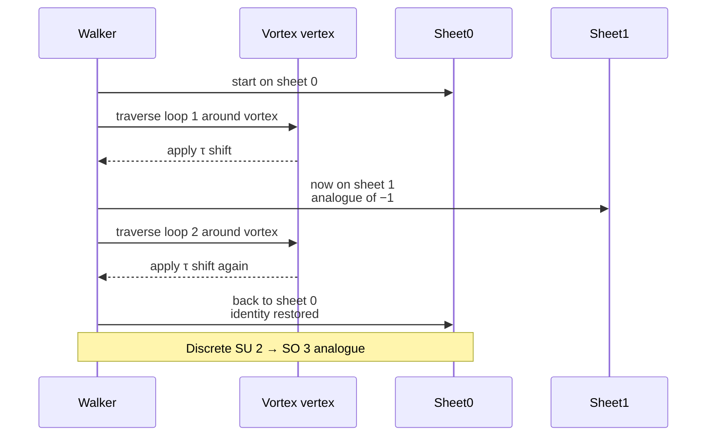

---

## 15. The Computational Toolkit

The algorithmic stack used to actually evaluate reconnection and dimensions.

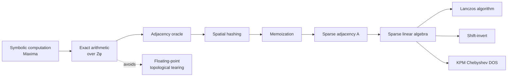

---

## 16. Quick Symbol Lookup

A class-like reference for the symbols of section N, grouped by role.

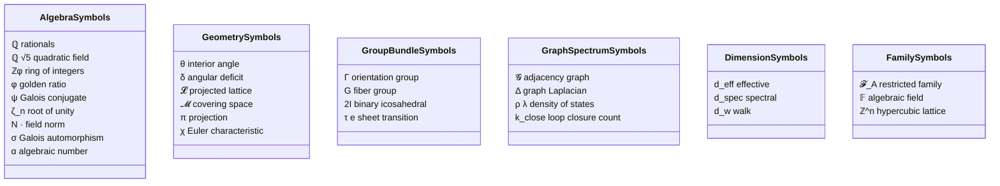

---

## 17. Cross-Document Citation Graph

Which project documents primarily develop which clusters of glossary concepts.

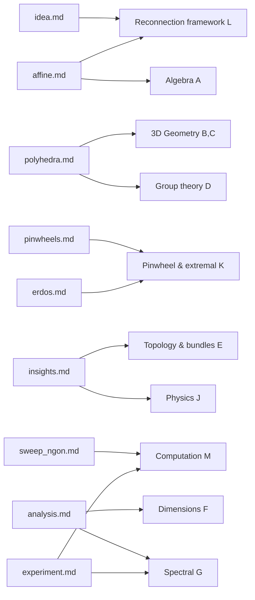

---

## Reading Suggestions

- For a **first pass**, read diagrams 1, 3, and 4 to get the macro story.
- For an **algebraic deep-dive**, follow 2, 10, and 16.
- For the **physics/topology side**, read 4, 5, 6, 11, and 14.
- For a **computational orientation**, read 7, 8, 9, 13, and 15.
- Diagram 17 is a map back into the project's other markdown files.
